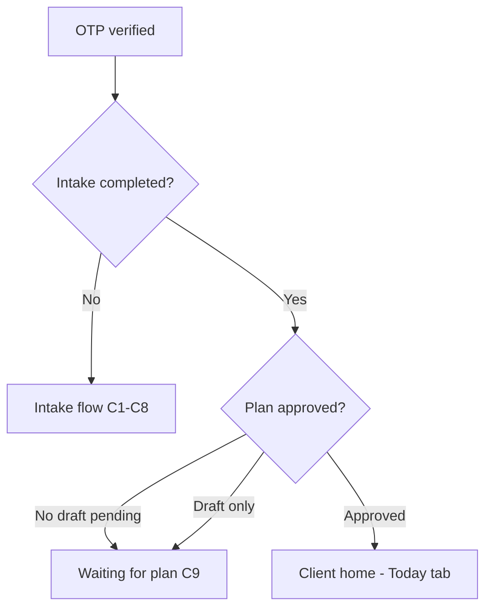
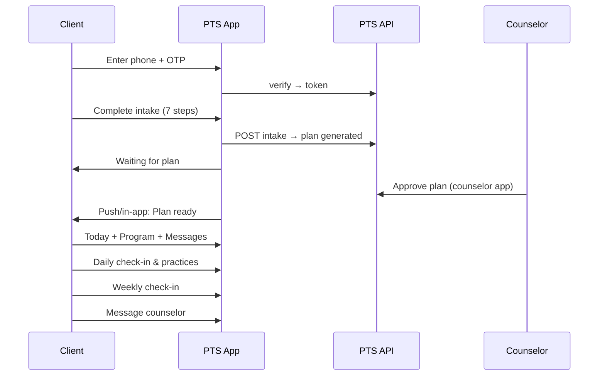
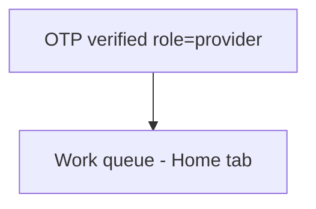
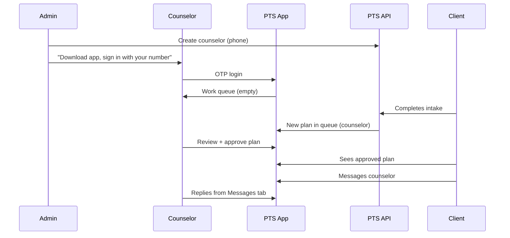

# PTS Mobile App — Full UX & Screen Specification

**Status:** Draft for review  
**Last updated:** 2026-05-29  
**Audience:** Product (Satheesh), Clinical (Ramya), Engineering  
**Scope:** One **Expo Android app** for clients + counselors. **Admin stays web-only.**

---

## 1. Product context

### What this app is
- Counseling-led recovery support for people whose pain has changed how they live.
- **Not** medical advice, diagnosis, or emergency care.
- Human counselor in the loop: reviews plans, messages, monitors flags.

### What this document covers
- Every screen a user **touches and feels** in the mobile app.
- Bottom navigation, menus, activities, and end-to-end flows.
- Routing rules (what you see when, based on account state).

### Out of scope (separate surfaces)
| Surface | Where |
|---------|--------|
| Marketing / discovery | Web (`pts-web-pied.vercel.app`) |
| Admin (create users, metrics, escalations) | Admin web (`/admin`) |
| Counselor credentialing paperwork | Admin web |

### Auth model (locked)
- **Phone only** (+91 India pilot).
- **OTP via MSG91** (ported from trainer-app-mvp-recovered).
- Account must **exist before OTP** — admin creates client or counselor with phone + role.
- One login screen → server returns `role` → app shows client or counselor experience.

---

## 2. Design principles (mobile)

1. **Mobile-first sessions** — 2–10 minutes; one primary action per screen.
2. **Crisis always reachable** — helpline access from any screen (persistent affordance).
3. **No outcome promises** — process language only (practices, reflection, support).
4. **Counselor queue is action-oriented** — “what needs me now?” not a data dump.
5. **Progressive disclosure** — intake is stepped; plan is week → day → practice.
6. **Offline-tolerant later** — MVP assumes online; show clear errors when offline.

---

## 3. Global elements (all authenticated screens)

### 3.1 Crisis strip (persistent)
Thin bar or tappable “Need help now?” that opens **Crisis sheet**:

| Resource | Detail |
|----------|--------|
| iCall | [tel:9152987821](tel:9152987821) |
| Aasra | [tel:9820466726](tel:9820466726) |
| Global | findahelpline.com |
| Safety copy | Link to in-app Safety guidelines |

*Matches web `CrisisResourcesBanner`; on mobile use bottom sheet to avoid clutter.*

### 3.2 “I’m struggling” (client only, Phase 1b)
Floating action or tab-adjacent button:

- Quick breathing / grounding (2–3 min)
- Message counselor (opens Messages)
- Crisis sheet

### 3.3 App header pattern
- **Title** (screen name)
- **Optional:** unread badge on Messages tab (not header)
- **No hamburger overload** — primary nav = bottom tabs; secondary items in Profile

---

## 4. Authentication flow (unauthenticated)

### Screen A0 — Splash / brand (optional, 1s)
- PTS logo + “Pain to Strength”
- Auto-advance to login if no stored session; else validate session → home

### Screen A1 — Login: Enter phone
**Goal:** Start OTP for registered users only.

| Element | Behaviour |
|---------|-----------|
| Title | “Sign in with your mobile” |
| Phone input | 10 digits, `+91` prefix fixed, numeric keyboard |
| CTA | **Continue** |
| Copy | “Your number must be registered by your program administrator.” |
| Footer link | **Safety guidelines** (read-only) |

**On Continue:**
1. `POST /api/auth/check-phone` → if `exists: false` → **Screen A1b**
2. If exists → `POST /api/auth/otp/send` → **Screen A2**

### Screen A1b — Number not registered
| Element | Copy |
|---------|------|
| Title | “This number isn’t registered yet” |
| Body | “Please contact your counselor or program administrator to get access.” |
| CTA | **Try another number** |
| Secondary | **Crisis resources** |

*No self-signup in pilot.*

### Screen A2 — Enter OTP
| Element | Behaviour |
|---------|-----------|
| Subtitle | “Code sent to +91 XXXXX XXXXX” |
| OTP input | 6 digits, `inputMode=numeric`, `autoComplete=one-time-code` |
| Resend | Disabled 15s countdown, then **Resend OTP** |
| CTA | **Verify & sign in** |
| Link | **Change number** |

**On verify success:**
- Store Bearer token (secure storage)
- `GET /api/auth/session` → route by role + account state (§5–6)

### Screen A3 — Session expired (modal)
Shown when API returns 401 mid-session.

- “Please sign in again” → **Screen A1**

---

## 5. Client experience

### 5.1 Client routing (after login)



| State | First screen |
|-------|----------------|
| No intake | Intake step 1 |
| Intake done, plan not approved | **Waiting for plan** |
| Plan approved | **Today** (home) |

---

### 5.2 Client bottom navigation (approved plan)

| Tab | Icon label | Primary purpose |
|-----|------------|-----------------|
| **Today** | Today | Daily engagement for current week/day |
| **Program** | Program | 6-week plan overview + week detail |
| **Messages** | Messages | Async chat with counselor (badge if unread) |
| **Profile** | Profile | Settings, safety, data, sign out |

*Intake-in-progress uses a simplified header with progress only (no tabs until intake complete).*

---

### 5.3 Client screens — intake (first-time)

Multi-step flow aligned with web `IntakeClient` (7 steps). Save-and-resume locally between steps; submit once at end.

| ID | Step title | Key fields / activities |
|----|------------|-------------------------|
| **C1** | Your situation | Pain source, description, duration |
| **C2** | A little about you | Age range, gender, occupation, work impact, dependents |
| **C3** | The impact on your life | Activities affected, biggest life change |
| **C4** | What recovery means to you | Recovery goal, timeline |
| **C5** | Your current support | Treatment, social support |
| **C6** | How you'd like to work | Structure preference, engagement time |
| **C7** | Safety check | Red flags list, “do these apply?”, safety question, consent |

**Chrome (all intake steps):**
- Progress bar “Step X of 7”
- **Back** / **Continue**
- Step 7: **Submit assessment**

**On submit:**
- If red flags / not safe → **C7a Crisis acknowledgment** then still submit (counselor alerted on backend)
- Success → **C8 Intake complete**

#### Screen C8 — Intake complete
| Element | Copy / action |
|---------|----------------|
| Title | “You're in. Your journey starts here.” |
| Body | Counselor reviews within ~24 hours; message when plan is ready |
| Primary CTA | **Go to messages** |
| Secondary | **What happens next?** (FAQ sheet) |

*Tabs hidden until plan approved; user can use Messages and read **Waiting for plan** from Program tab.*

---

### 5.4 Client screens — waiting for plan

#### Screen C9 — Waiting for plan (Program tab default when unapproved)
| Section | Content |
|---------|---------|
| Status card | “Your counselor is preparing your personalised plan” |
| Timeline | Submitted → Under review → Ready (checkmarks) |
| Actions | **Message counselor**, **Review your intake** (read-only summary) |
| Note | Plan preview may show “draft” disclaimer if visible |

---

### 5.5 Client — Today tab (home)

#### Screen C10 — Today (daily home)
**Goal:** One screen for “what do I do right now?”

| Section | Content |
|---------|---------|
| Greeting | “Good morning, {first name}” + current week/day |
| Morning check-in card | Pain 0–10, sleep quality, one intention (if not done today) |
| Today's practice | One practice from approved plan (title, duration, instructions) |
| Mark complete | Checkbox + optional “How did it feel?” (short text or emoji scale) |
| Evening reflection | Shown after 6pm local or when morning+practice done |
| Quick links | **Message counselor**, **I'm struggling** |

**Empty states:**
- No approved plan → redirect **C9**
- Weekend / rest day → “Rest & reflect” variant copy

#### Screen C11 — Morning check-in (modal or inline expand)
- Pain slider 0–10
- Sleep: Poor / OK / Good
- “One thing I want to do today” (short text)
- **Save** → updates Today card

#### Screen C12 — Practice detail
- Full practice text from plan
- Timer optional (5 min default)
- **Mark done** → return to Today

#### Screen C13 — Evening reflection
- “What happened today?”
- “What worked?”
- “What was hard?”
- **Submit** (feeds future counselor view / weekly check-in)

---

### 5.6 Client — Program tab

#### Screen C14 — Program overview
| Section | Content |
|---------|---------|
| Header | “Your 6-week program” + counselor name |
| Week list | Weeks 1–6 cards: theme, status (locked / current / complete) |
| Current week | Highlighted |
| Footer | **Weekly check-in** (if due), **Book a session** (Calendly link) |

#### Screen C15 — Week detail
| Section | Content |
|---------|---------|
| Week theme + focus | From approved plan |
| Daily practices | List Mon–Sun or Day 1–7 |
| Reflection prompt | Weekly question |
| Counselor note | If present |
| Tap day | → **C16 Day detail** |

#### Screen C16 — Day detail
- Practices for that day (3 items typical)
- Link to open in **Today** if today

#### Screen C17 — Weekly check-in
| Prompt | Type |
|--------|------|
| What did you do most days this week? | Text |
| What felt easier vs harder? | Text |
| Pain trend vs last week | Scale |
| One adjustment for next week | Text |
| **Submit** | Confirmation toast |

*Aligns with web `/check-in`.*

#### Screen C18 — Book a session
- Counselor name + Calendly embed (in-app WebView) or external browser
- Copy: “Sessions are with your counselor; booking confirms via Calendly.”

---

### 5.7 Client — Messages tab

#### Screen C19 — Conversation list
| Row | Shows |
|-----|-------|
| Counselor thread | Name, last message preview, time, **unread badge** |

*Pilot: single counselor only.*

#### Screen C20 — Message thread
| Element | Behaviour |
|---------|-----------|
| Header | Counselor name + **Book session** |
| Thread | Bubbles, timestamps |
| Composer | Text + Send (Enter to send) |
| Polling | 8s refresh (MVP); WebSocket later |

---

### 5.8 Client — Profile tab

#### Screen C21 — Profile home
| Menu item | Destination |
|-----------|-------------|
| My details | Name, phone (read-only), display name edit |
| Notifications | Enable reminders (FCM Phase 2) |
| Your data & consent | **C22** |
| Safety guidelines | **C23** |
| Flare-up support | **C24** |
| About PTS | Version, disclaimers |
| Sign out | Clears token → **A1** |

#### Screen C22 — Your data & consent
- Consent toggles (storage, encryption) — mirrors web `/support`
- Export data link
- Delete stored artifacts (with confirm)

#### Screen C23 — Safety guidelines
- Red flag symptoms list
- What to do next
- Crisis numbers
- *Mirrors web `/red-flags`*

#### Screen C24 — Flare-up protocol
- Short protocol when pain spikes
- When to pause program vs seek care
- *Mirrors web `/flare-up`*

---

### 5.9 Client end-to-end journey (happy path)



---

## 6. Counselor experience

### 6.1 Counselor routing (after login)



*No intake. Counselor accounts are created by admin with `provider` role.*

---

### 6.2 Counselor bottom navigation

| Tab | Label | Purpose |
|-----|-------|---------|
| **Home** | Home | Work queue — needs action |
| **Clients** | Clients | Caseload list |
| **Messages** | Messages | All client threads (unread badges) |
| **Profile** | Profile | My profile, Calendly, sign out |

---

### 6.3 Counselor — Home tab (work queue)

#### Screen P1 — Work queue (default home)
**Goal:** Answer “what needs me now?” in under 10 seconds.

| Section | Items |
|---------|-------|
| **Alerts** (red if any) | Red-flag intakes, crisis-marked plans, unsafe reports |
| **Pending plan reviews** | Count + list (client name, submitted time) → **P4** |
| **Unread messages** | Count + recent senders → **P7** |
| **Clients inactive 3+ days** | Nudge list (Phase 1b) |
| **Today's snapshot** | Active clients, intakes this week |

**Queue card actions:**
- Tap plan review → **P4 Plan review**
- Tap message → **P8 Thread**
- Tap red flag → **P5 Client detail** (safety context)

#### Screen P2 — Metrics snapshot (optional scroll on Home)
- Compact KPIs: clients, intakes, approvals, messages
- Link: “Full metrics on web” (opens provider metrics in browser for pilot)

*Full dashboard can stay web; mobile shows actionable subset.*

---

### 6.4 Counselor — Clients tab

#### Screen P3 — Client list
| Row | Shows |
|-----|-------|
| Client | Display name or anonymised id |
| Status chips | Intake ✓ / Plan pending / Plan active |
| Flags | Red flag icon if any |
| Last activity | Last message or check-in time |
| Sort | Needs attention first (flags → pending plan → unread) |

#### Screen P5 — Client detail
| Section | Content |
|---------|---------|
| Header | Name, pain archetype, assigned date |
| Intake summary | Situation, goal, key demographics |
| Plan status | Draft / Approved + link to plan |
| Engagement | Last check-in, practices this week (when available) |
| Red flags | Prominent if present |
| Actions | **Message**, **Review plan**, **View intake** (read-only) |

#### Screen P6 — Intake read-only
- Full intake responses formatted for clinical scan
- Safety answers highlighted

---

### 6.5 Counselor — Plan review

#### Screen P4 — Plan review
| Section | Content |
|---------|---------|
| Client context card | Pain source, situation, goal |
| Counselor summary | LLM `clientSummary` |
| Program | Overview + themes |
| Weeks 1–6 | Expandable accordion |
| Crisis banner | If 🚨 CRISIS notes auto-applied |
| Notes field | Optional counselor note |
| **Approve plan** | Primary CTA |
| **Request changes** (Phase 2) | Message client instead |

**On approve:**
- Success state + **Message client** shortcut

*Mirrors web `PlanReviewClient`.*

---

### 6.6 Counselor — Messages tab

#### Screen P7 — Conversation list
- All assigned clients with threads
- Unread badge per client
- Sort by recent activity

#### Screen P8 — Message thread
- Same pattern as client **C20** but counselor-facing
- Header: client name + link to **P5 Client detail**
- No Calendly on counselor side

---

### 6.7 Counselor — Profile tab

#### Screen P9 — Profile home
| Menu item | Destination |
|-----------|-------------|
| My profile | Name, title, credentials, bio (read-only in pilot; edit on web) |
| Calendly link | Show/edit URL (opens web form pilot) |
| Notifications | New client, new message, red flag alerts |
| Sign out | → **A1** |

#### Screen P10 — My public profile (read-only preview)
- What clients see: name, credentials, specialisations, bio

---

### 6.8 Counselor end-to-end journey (happy path)



---

## 7. Admin web (reference only — not in mobile app)

For completeness, admin creates the accounts mobile users need:

| Admin action | Mobile effect |
|--------------|---------------|
| Create client (`phone`, role=client) | Client can OTP login → intake |
| Create counselor (`phone`, role=provider) | Counselor can OTP login → work queue |
| View metrics / escalations | No mobile equivalent in v1 |

---

## 8. Screen inventory (summary)

| ID | Screen | Role | Tab |
|----|--------|------|-----|
| A0–A3 | Auth / OTP | Both | — |
| C1–C8 | Intake + complete | Client | — |
| C9 | Waiting for plan | Client | Program |
| C10–C13 | Today / check-ins | Client | Today |
| C14–C18 | Program / weeks / booking | Client | Program |
| C19–C20 | Messages | Client | Messages |
| C21–C24 | Profile & safety | Client | Profile |
| P1–P2 | Work queue | Counselor | Home |
| P3–P6 | Clients | Counselor | Clients |
| P4 | Plan review | Counselor | (from queue) |
| P7–P8 | Messages | Counselor | Messages |
| P9–P10 | Profile | Counselor | Profile |

**Total MVP screens:** ~28 distinct views (some share layouts).

---

## 9. MVP vs later phases

### MVP (pilot — build first)
- OTP login (phone, +91)
- Client: full intake, waiting for plan, approved plan view, messages
- Client: Today (simplified daily checklist from plan), Program overview
- Counselor: work queue, plan approve, client list, messages
- Crisis sheet + safety guidelines
- Profile + sign out

### Phase 1b (soon after pilot)
- Morning / evening structured check-ins
- Weekly check-in submission
- “I’m struggling” button
- FCM push notifications
- Calendly in-app WebView

### Phase 2
- Plan versioning / counselor edit
- Inactive client nudges
- Counselor profile edit on mobile
- Offline caching for today's practice

---

## 10. Visual & interaction notes (for prototype)

| Pattern | Recommendation |
|---------|----------------|
| Primary color | `#111` text, `#fbbf24` accent (match web) |
| Touch targets | Min 44px |
| Typography | `clamp()` / system fonts |
| Lists | Cards, not dense tables |
| Loading | Skeleton on Today + queue |
| Errors | Plain language, retry button |

---

## 11. Localhost prototype plan (after your approval)

Once you approve this document, engineering will:

1. **Scaffold `apps/mobile`** (Expo Router)
2. **Implement clickable prototype** with mock data:
   - Full navigation + all screens above
   - OTP flow simulated (123456 for test phones)
   - Role switcher in dev menu (preview client vs counselor without backend)
3. **Run on localhost:**
   ```bash
   cd apps/mobile && npm install && npx expo start
   ```
   - Press `w` for web preview in browser (fastest for your review)
   - Or Android emulator / Expo Go on device

4. **Phase B:** Wire to PTS API (`pts-web-pied.vercel.app` or local `apps/web`)

*Prototype first = you click through every screen before we integrate APIs.*

---

## 12. Open questions for your review

Please mark approve / change on each:

| # | Question | Recommendation |
|---|----------|----------------|
| 1 | Client tabs before plan approved: hide all except Messages + Waiting? | **Yes** — reduce noise |
| 2 | Counselor “Request changes” on plan or message-only for MVP? | **Message-only** for MVP |
| 3 | Show client email anywhere on mobile? | **No** — phone identity only |
| 4 | Anonymise client name for counselor (e.g. first name only)? | **First name + id suffix** for pilot |
| 5 | Book session: in-app WebView vs external browser? | **External browser** for MVP |

---

## 13. Approval checklist

- [ ] Auth flow (OTP, no self-signup) approved
- [ ] Client tab structure approved
- [ ] Counselor tab structure approved
- [ ] Intake 7 steps match clinical expectations
- [ ] Work queue priorities correct for Ramya
- [ ] MVP scope (§9) agreed
- [ ] Ready for localhost clickable prototype

---

**Next step:** Your review comments on this doc → then we build the Expo prototype for localhost walkthrough.
